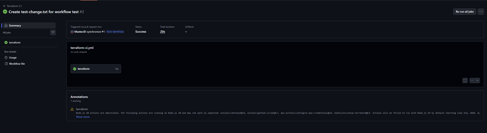

# Terraform CI Pipeline

## Evidence
- PR: https://github.com/pagreda888/oyd-exercise-2-2/pull/1
- 

## Local credential override
Terraform uses the standard AWS credential chain. For local testing, you can set AWS_* environment variables from a .env file, or use existing environment variables or ~/.aws/credentials. The same Terraform commands are used in CI and locally.

### PowerShell
```powershell
Get-Content .env | ForEach-Object {
  if ($_ -match '^\s*#' -or $_ -match '^\s*$') { return }
  $pair = $_ -split '=', 2
  Set-Item -Path "Env:$($pair[0])" -Value $pair[1]
}
```

### Bash
```bash
set -a
. ./.env
set +a
```

### Plan (same as CI)
```bash
terraform fmt --check -recursive
terraform init -backend=false
terraform validate
terraform plan -var-file=envs/dev/dev.tfvars | tee plan.txt
```

## Verification
1. Run the plan using local override credentials and save the output:
   terraform plan -var-file=envs/dev/dev.tfvars | tee plan-local.txt
2. Start a clean shell and run the plan using real AWS credentials and save the output:
   terraform plan -var-file=envs/dev/dev.tfvars | tee plan-real.txt
3. Compare outputs:
   PowerShell: Compare-Object (Get-Content plan-local.txt) (Get-Content plan-real.txt)
   Bash: diff -u plan-local.txt plan-real.txt
Expected: no differences in resources planned, output structure, or execution behavior.
